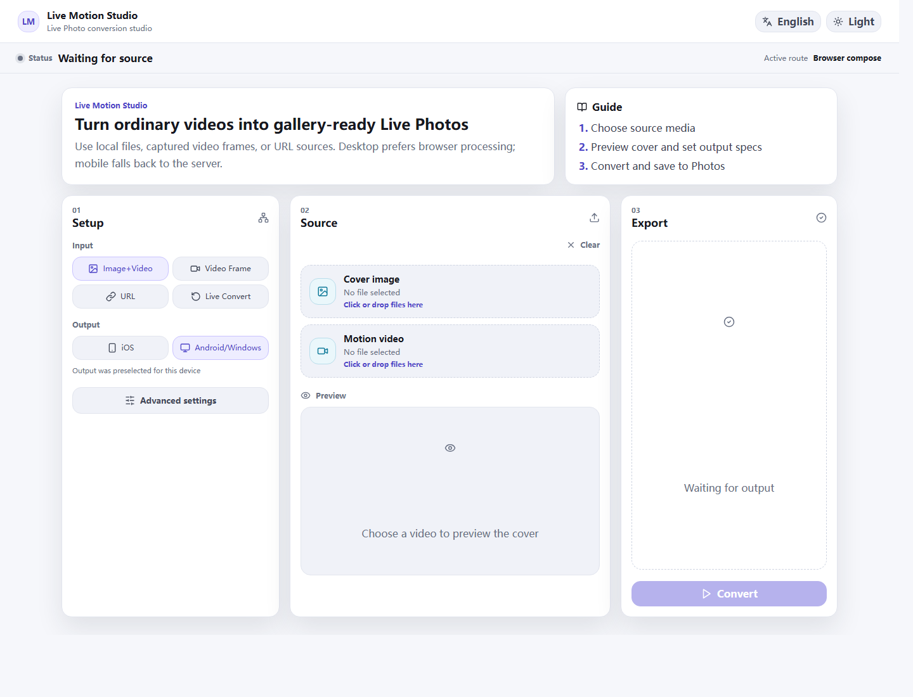
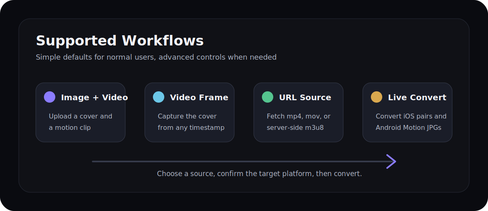
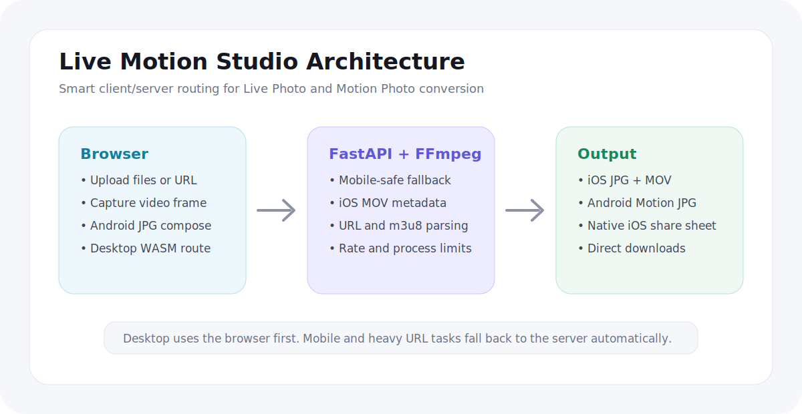

# Live Motion Studio Guide

Live Motion Studio is a self-hosted web app for converting between iOS Live Photos, Android/Windows Motion Photos, still images, and regular videos.



## Who It Is For

- People who want to turn ordinary videos into gallery-recognized Live Photos.
- People who want to convert iPhone Live Photos into Android/Windows single-file Motion Photos.
- People deploying a private tool on a LAN, NAS, home server, or Docker host.
- Mobile users who should not have to fight `ffmpeg.wasm`, CORS, or Safari gesture expiration.

## Features



- Create an iOS Live Photo or Android/Windows Motion Photo from an image and a video.
- Upload only a video and capture a cover frame at a selected timestamp.
- Convert a direct mp4/mov/m3u8 video URL.
- Convert iOS Live Photo `JPG + MOV` pairs to one Android/Windows Motion Photo JPG.
- Convert Android/Windows Motion Photo JPG files back to iOS Live Photo output.
- Automatically choose the default output from the device: iPhone/iPad -> iOS, Android/Windows -> Android/Windows.
- Keep the regular UI simple and hide expert options under Advanced Settings.

## Quick Deployment

### Build from source

```bash
cp .env.example .env
docker compose up -d --build
```

Open:

```text
http://localhost:8787
```

For another device on the same LAN:

```text
http://<host-lan-ip>:8787
```

### Use the published image

```bash
cp .env.example .env
docker compose -f docker-compose.prod.yml up -d
```

Default image:

```text
ghcr.io/maverickxu/live-motion-studio:latest
```

### Check status

```bash
docker compose ps
docker compose logs -f
curl http://localhost:8787/api/health
```

Expected response:

```json
{"status":"ok"}
```

## Usage

### Image + video to Live Photo

1. Choose `Image+Video`.
2. Upload a cover image and a motion video.
3. Confirm the output format; the app preselects it from the current device.
4. Click `Convert`.
5. iOS users save from the system share sheet; Android/Windows users download one Motion Photo JPG.

### Video frame + video to Live Photo

1. Choose `Video Frame`.
2. Upload a video.
3. Adjust the cover timestamp and preview the frame.
4. Click `Convert`.

### URL to Live Photo

1. Choose `URL`.
2. Paste a direct mp4/mov/m3u8 video link.
3. Keep routing on `Auto`, or choose `Server` in Advanced Settings for m3u8/CORS cases.
4. Click `Convert`.

### iOS to Android/Windows

1. Choose `Live Convert`.
2. Choose `Android/Windows` output.
3. Upload the iOS Live Photo JPG and MOV.
4. Click `Convert` to get one Motion Photo JPG.

### Android/Windows to iOS

1. Choose `Live Convert`.
2. Choose `iOS` output.
3. Upload the Android/Windows Motion Photo JPG.
4. The app extracts the embedded video and creates an iOS Live Photo.

## Common Environment Variables

| Variable | Default | Description |
| --- | --- | --- |
| `LIVE_MOTION_PORT` | `8787` | Host port |
| `LIVE_MOTION_IMAGE` | `ghcr.io/maverickxu/live-motion-studio:latest` | Production image |
| `LIVEPHOTO_ALLOW_PRIVATE_URLS` | `1` | Allow backend access to private/LAN URLs |
| `LIVEPHOTO_LOCALHOST_TO_HOST` | `1` | Rewrite localhost URLs to the Docker host |
| `LIVEPHOTO_DAILY_IP_LIMIT` | `10` | Daily conversions per IP |
| `LIVEPHOTO_FFMPEG_CONCURRENCY` | `2` | Concurrent FFmpeg process limit |
| `LIVEPHOTO_MAX_UPLOAD_MB` | `160` | Max uploaded file size in MB |
| `LIVEPHOTO_MAX_URL_MB` | `160` | Max downloaded URL size in MB |

LAN deployments usually work with defaults. For public deployments, use:

```env
LIVEPHOTO_ALLOW_PRIVATE_URLS=0
LIVEPHOTO_ALLOWED_ORIGINS=https://your-domain.example
```

## Reverse Proxy

If you deploy behind Nginx/Caddy/Traefik, keep these response headers so the desktop WASM route can run:

```nginx
add_header Cross-Origin-Opener-Policy same-origin always;
add_header Cross-Origin-Embedder-Policy require-corp always;
```

Nginx example:

```nginx
server {
  listen 80;
  server_name live-photo.example.com;

  location / {
    proxy_pass http://127.0.0.1:8787;
    proxy_set_header Host $host;
    proxy_set_header X-Forwarded-For $proxy_add_x_forwarded_for;
    proxy_set_header X-Forwarded-Proto $scheme;
    add_header Cross-Origin-Opener-Policy same-origin always;
    add_header Cross-Origin-Embedder-Policy require-corp always;
  }
}
```

## Technical Notes



- Frontend: Vite + React + TypeScript.
- Desktop: when `SharedArrayBuffer` and `crossOriginIsolated` are available, local files prefer the `ffmpeg.wasm` route.
- Mobile: uses the FastAPI backend automatically, avoiding iOS Safari SharedArrayBuffer limitations.
- Backend: Python + FastAPI + FFmpeg.
- Video input: backend reads uploads through `pipe:0` to avoid writing large inputs to disk.
- Video output: `faststart` needs seekable output, so the backend writes only the final output to `TemporaryDirectory` and deletes it immediately after reading.
- Protection: FFmpeg concurrency lock, per-IP daily rate limit, URL SSRF checks, and upload size limits.

### iOS Metadata

iOS Live Photos require the JPG and MOV to share the same Content Identifier. MOV packaging writes metadata at both the global and video stream levels:

```bash
-fflags +genpts -c copy -movflags use_metadata_tags+faststart -map_metadata 0 \
-metadata:s:v com.apple.quicktime.content.identifier={UUID} \
-metadata com.apple.quicktime.content.identifier={UUID}
```

### Android/Windows Motion Photo Metadata

Android/Windows output is a single JPG file: the JPG receives XMP metadata, then MP4 bytes are appended to the end of the JPG.

## Local Development

```bash
npm install
python -m venv .venv
.venv/Scripts/pip install -r backend/requirements.txt
.venv/Scripts/uvicorn backend.app.main:app --host 127.0.0.1 --port 8787 --reload
npm run dev
```

Frontend dev server:

```text
http://localhost:5173
```

## References

- Original idea reference: [flashlab/motion-live-photo](https://github.com/flashlab/motion-live-photo)
- Android Motion Photo format: <https://developer.android.com/media/platform/motion-photo-format>
- Apple LivePhotosKit JS: <https://developer.apple.com/documentation/LivePhotosKitJS>
