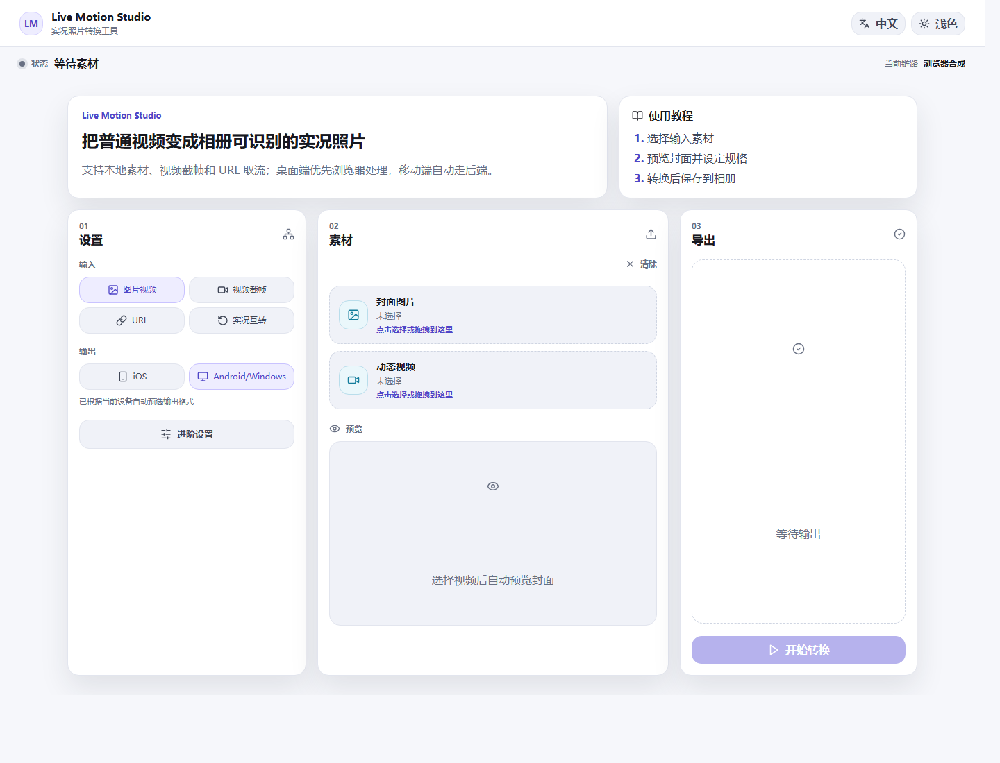
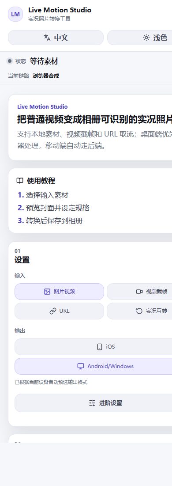

# Live Motion Studio 中文教程

Live Motion Studio 是一个可以自部署的实况照片转换工具，用来在 iOS Live Photo、Android/Windows Motion Photo、普通图片和普通视频之间转换。



## 适合谁

- 想把普通视频做成手机相册可识别的实况照片。
- 想把 iPhone Live Photo 转成 Android/Windows 可保存的单文件动态照片。
- 想在局域网、NAS、家用服务器或自己的 Docker 环境里部署转换工具。
- 想让移动端用户少踩 `ffmpeg.wasm`、跨域、Safari 手势过期等坑。

## 功能概览


- 图片 + 视频生成 iOS Live Photo 或 Android/Windows Motion Photo。
- 只上传视频时，自动截取指定时间的帧作为封面。
- 输入 mp4/mov/m3u8 视频直链，由浏览器或后端自动处理。
- iOS Live Photo 的 `JPG + MOV` 转为 Android/Windows Motion Photo 单文件 JPG。
- Android/Windows Motion Photo JPG 转为 iOS Live Photo。
- 根据设备自动选择默认输出：iPhone/iPad 默认 iOS，Android/Windows 默认 Android/Windows。
- 默认只展示基础流程，高级参数收进“进阶设置”。

## 快速部署

### 源码构建

```bash
cp .env.example .env
docker compose up -d --build
```

访问：

```text
http://localhost:8787
```

局域网内其他设备访问：

```text
http://<服务器局域网IP>:8787
```

### 使用已发布镜像

```bash
cp .env.example .env
docker compose -f docker-compose.prod.yml up -d
```

默认镜像：

```text
ghcr.io/maverickxu/live-motion-studio:latest
```

### 查看状态

```bash
docker compose ps
docker compose logs -f
curl http://localhost:8787/api/health
```

正常返回：

```json
{"status":"ok"}
```

## 使用教程

### 图片 + 视频转实况照片

1. 选择“图片视频”。
2. 上传封面图片和动态视频。
3. 确认输出格式，默认会按当前设备自动选择。
4. 点击“开始转换”。
5. iOS 用户在系统分享面板中选择“存储图像”；Android/Windows 用户下载单个 Motion Photo JPG。

### 视频截帧 + 视频转实况照片

1. 选择“视频截帧”。
2. 上传视频。
3. 调整“封面时间”，页面会自动预览封面。
4. 点击“开始转换”。

### URL 转实况照片

1. 选择“URL”。
2. 粘贴 mp4/mov/m3u8 视频直链。
3. 如果遇到跨域或 m3u8，保持“自动”，或在“进阶设置”里选择“后端”。
4. 点击“开始转换”。

### iOS 转 Android/Windows

1. 选择“实况互转”。
2. 输出选择“Android/Windows”。
3. 上传 iOS Live Photo 的 JPG 和 MOV。
4. 点击“开始转换”，得到单个 Motion Photo JPG。

### Android/Windows 转 iOS

1. 选择“实况互转”。
2. 输出选择“iOS”。
3. 上传 Android/Windows Motion Photo JPG。
4. 系统会自动拆出内嵌视频并生成 iOS Live Photo。

## 移动端界面



## 常用环境变量

| 变量 | 默认值 | 说明 |
| --- | --- | --- |
| `LIVE_MOTION_PORT` | `8787` | 宿主机暴露端口 |
| `LIVE_MOTION_IMAGE` | `ghcr.io/maverickxu/live-motion-studio:latest` | 生产部署镜像 |
| `LIVEPHOTO_ALLOW_PRIVATE_URLS` | `1` | 是否允许后端访问内网 URL |
| `LIVEPHOTO_LOCALHOST_TO_HOST` | `1` | 容器内是否把 localhost 改写到宿主机 |
| `LIVEPHOTO_DAILY_IP_LIMIT` | `10` | 每 IP 每日转换次数 |
| `LIVEPHOTO_FFMPEG_CONCURRENCY` | `2` | 同时运行的 FFmpeg 数量 |
| `LIVEPHOTO_MAX_UPLOAD_MB` | `160` | 单个上传文件最大大小 |
| `LIVEPHOTO_MAX_URL_MB` | `160` | URL 下载最大大小 |

局域网部署通常保持默认即可。公网部署建议设置：

```env
LIVEPHOTO_ALLOW_PRIVATE_URLS=0
LIVEPHOTO_ALLOWED_ORIGINS=https://your-domain.example
```

## 反向代理

如果使用 Nginx/Caddy/Traefik，请保留以下响应头，否则桌面端 WASM 链路可能不可用：

```nginx
add_header Cross-Origin-Opener-Policy same-origin always;
add_header Cross-Origin-Embedder-Policy require-corp always;
```

Nginx 示例：

```nginx
server {
  listen 80;
  server_name live-photo.example.com;

  location / {
    proxy_pass http://127.0.0.1:8787;
    proxy_set_header Host $host;
    proxy_set_header X-Forwarded-For $proxy_add_x_forwarded_for;
    proxy_set_header X-Forwarded-Proto $scheme;
    add_header Cross-Origin-Opener-Policy same-origin always;
    add_header Cross-Origin-Embedder-Policy require-corp always;
  }
}
```

## 技术说明


- 前端：Vite + React + TypeScript。
- 桌面端：支持 `SharedArrayBuffer` 和 `crossOriginIsolated` 时，本地文件优先走 `ffmpeg.wasm`。
- 移动端：自动走 FastAPI 后端，避免 iOS Safari 对 SharedArrayBuffer 的限制。
- 后端：Python + FastAPI + FFmpeg。
- 输入视频：后端使用 `pipe:0` 读取，避免大文件落盘。
- 输出视频：因为 `faststart` 需要可 seek 输出，临时写入 `TemporaryDirectory`，读取后立即销毁。
- 保护机制：FFmpeg 并发锁、IP 每日限流、URL SSRF 保护、上传大小限制。

### iOS 元数据

iOS Live Photo 需要 JPG 和 MOV 使用同一个 Content Identifier。MOV 封装时会同时写入全局和视频流级别元数据：

```bash
-fflags +genpts -c copy -movflags use_metadata_tags+faststart -map_metadata 0 \
-metadata:s:v com.apple.quicktime.content.identifier={UUID} \
-metadata com.apple.quicktime.content.identifier={UUID}
```

### Android/Windows Motion Photo 元数据

Android/Windows 输出为单个 JPG 文件：JPG 写入 XMP 后，MP4 二进制会拼接到 JPG 末尾。

## 本地开发

```bash
npm install
python -m venv .venv
.venv/Scripts/pip install -r backend/requirements.txt
.venv/Scripts/uvicorn backend.app.main:app --host 127.0.0.1 --port 8787 --reload
npm run dev
```

前端开发地址：

```text
http://localhost:5173
```

## 参考

- Original idea reference: [flashlab/motion-live-photo](https://github.com/flashlab/motion-live-photo)
- Android Motion Photo format: <https://developer.android.com/media/platform/motion-photo-format>
- Apple LivePhotosKit JS: <https://developer.apple.com/documentation/LivePhotosKitJS>
